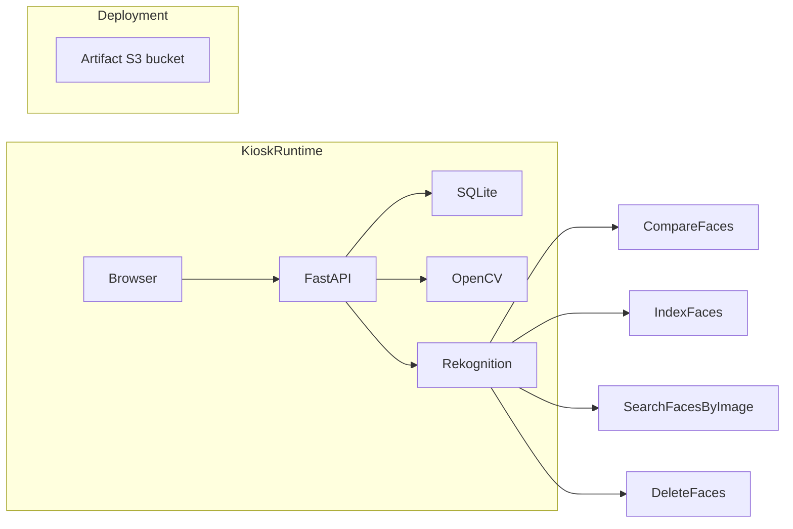
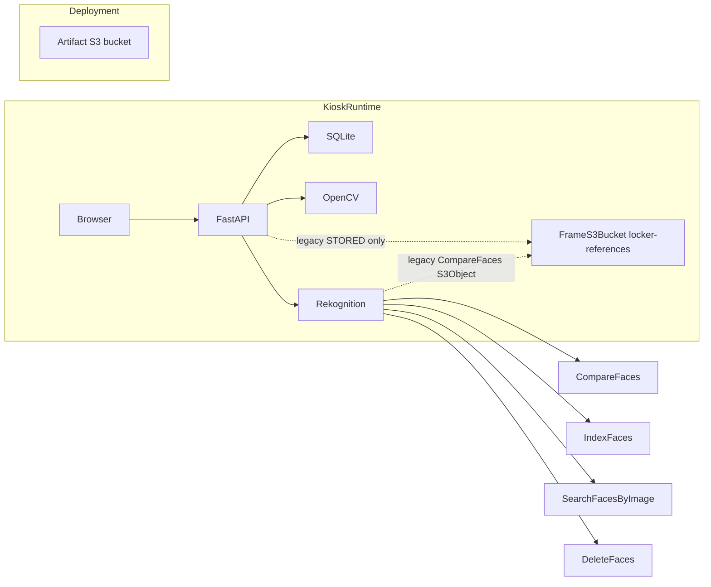

# Remove Legacy S3

Local working tree `~/workspace/aws-face-detection` is the source of truth.
This document records a **read-only** investigation plus the **local-only**
code change that was safe: unused STORE `PutObject` (`save_reference_face`)
was deleted. No AWS mutation, no SQLite DELETE, no locker update, no IAM
Role change, no CloudFormation deploy, no git commit/push.

## 1. 현재 S3가 남은 이유

신규 STORE/RETRIEVE는 Rekognition Collection + FaceId다.

- STORE complete: `IndexFaces(FRAME-A)` → SQLite FaceId. `locker-references/`
  를 만들지 않는다.
- RETRIEVE: `SearchFacesByImage` + expected FaceId. 성공 후 `DeleteFaces`.
- 운영자 capture-frame / Kinesis / Lambda / API Gateway 코드는 working tree
  에서 이미 제거됐다.

런타임에 S3 client가 남은 이유는 **단 하나**다. SQLite에 FaceId가 없고
`reference_face_s3_key`가 있는 STORED 거래 1건이 있어,
`stored_auth_mode == legacy_s3` 분기가 HeadObject + CompareFaces(S3Object)
+ DeleteObject를 탄다.

신규 Collection 경로는 S3를 호출하지 않는다.

## 2. 현재 Legacy Blocker

DB path (코드 기본값 / 현재 `.env` 미지정):

`web-ui/backend/data/kiosk.sqlite3`

이 파일은 seed fixture가 아니다. `KioskStore`가 생성하는 운영 SQLite이고,
이 호스트의 local uvicorn이 같은 경로를 쓴다. UUID가 테스트/시드 코드에
없다.

조회 조건 (실제 컬럼명):

```sql
SELECT COUNT(*) FROM transactions
WHERE status = 'STORED'
  AND rekognition_face_id IS NULL
  AND reference_face_s3_key IS NOT NULL;
```

`legacy_active_transaction_count = 1`

추가로 같은 파일에:

| 상태 | 건수 | 의미 |
|---|---|---|
| STORED + FaceId | 1 | 신규 Collection 거래 (locker 07) |
| STORED + FaceId NULL + S3 key | 1 | **S3 blocker** (locker 01) |
| STORED + FaceId NULL + S3 key NULL | 1 | 이미 인증 수단 없음 (locker 02) |
| RETRIEVED + S3 key + deleted_at | 3 | 과거 legacy, 활성 아님 |

## 3. Active Legacy Transactions

개인정보 없이 활성 legacy 1건:

| field | value |
|---|---|
| transaction_id | `96122d72-448f-4cbf-be7f-f76ba787ce8a` |
| locker_id | `01` |
| transaction status | `STORED` |
| locker 01 status | `OCCUPIED` (스키마에 locker=`STORED`는 없음. OCCUPIED가 정상) |
| locker.active_transaction_id | 위 transaction과 일치 |
| rekognition_face_id_present | no |
| rekognition_collection_id_present | no |
| face_indexed_at | NULL |
| reference_s3_key_present | yes |
| reference_s3_prefix | `locker-references/` |
| reference_face_deleted_at | NULL |
| retrieval_code_present | yes (8 digits) |
| created_at | `2026-08-12T03:43:52.092+00:00` |
| stored_at | `2026-08-12T03:43:55.073+00:00` |

질문과 답:

- transaction status는 정말 STORED인가? **예.**
- locker 01도 STORED인가? locker 컬럼은 **OCCUPIED**. 이것이 STORED 거래의
  정상 locker 상태다.
- retrieval code가 존재하는가? **예.** 8자리.
- 실제 retrieve 가능한 상태인가?
  - SQLite + 코드 기준: lookup은 `legacy_s3`로 ready.
  - AWS 기준: 대상 object **404**. retrieve start는 HeadObject 실패 후
    `REFERENCE_FACE_MISSING`이고 락커는 열리지 않는다.
- 테스트/seed 데이터라고 코드상 확정 가능한가? **아니오.** UUID는 코드에
  없고, 같은 DB에 8/10~8/15 실제 사용 흔적(CANCELLED 12, EXPIRED 3,
  RETRIEVED 6, STORED 3)이 있다.
- 실제 사용자의 물품일 가능성을 배제할 수 있는가? **배제할 수 없다.**
  locker 01은 2026-08-12 이후 OCCUPIED로 남아 있다.

따라서 이 row를 DELETE하거나 locker를 AVAILABLE로 바꾸지 않았다.

locker 02 (`f1e4ffae-…`, STORED since 2026-08-10)는 S3 key도 FaceId도 없다.
S3 제거 blocker는 아니지만, 이미 retrieve 불가인 별도 데이터 이슈다.

## 4. Bucket / Object State

Read-only (내용 다운로드 없음):

| Check | Result |
|---|---|
| Account | `115019372648` |
| Role | `AwsFaceDetectionKioskRole` / `i-060ed51daa9abc84f` |
| Region | `ap-northeast-2` |
| Frame bucket | `aws-face-detection-frames-115019372648-apne2` **exists** |
| `head-object` `locker-references/96122d72-…/reference.jpg` | **404** |
| `list_objects_v2` `locker-references/` | **0 objects** |
| `frames/` | 0 |
| `logging/` | 0 |
| Artifact bucket | `aws-face-detection-lambda-115019372648-apne2` **exists** (head only) |
| Collection | `kiosk-face-collection` exists, FaceCount=1 |

`video-analyzer-stack` (`CREATE_COMPLETE`) PhysicalResourceId:

- `FrameS3Bucket` → `aws-face-detection-frames-115019372648-apne2`
- `KioskFaceCollection` → `kiosk-face-collection`

Live stack은 local kiosk-only 템플릿과 **다르다**. 아직 Kinesis / Lambda /
DynamoDB / API Gateway 27개 추가 리소스가 있고, 여러 개가 FrameS3Bucket에
의존한다.

## 5. Runtime S3 Dependencies

분류:

| 위치 | 분류 | 유지/제거 |
|---|---|---|
| `app.py` `_s3 = boto3.client("s3")` | A. Legacy kiosk runtime | **유지** (blocker=1) |
| `reference_face.reference_object_exists` HeadObject | A | **유지** |
| `compare_reference_to_face_bytes` CompareFaces S3Object | A | **유지** (boto3 GetObject 아님. Rekognition이 S3를 읽음 → IAM GetObject 필요) |
| `delete_reference_face` DeleteObject | A | **유지** |
| `save_reference_face` PutObject | A leftover | **로컬 제거** (STORE가 이미 호출하지 않음) |
| `build_reference_face_s3_key` | A helper | **유지** (legacy retrieve key) |
| `config.FRAME_S3_BUCKET` / `KIOSK_REFERENCE_S3_PREFIX` | A config | **유지** |
| `build.py` artifact upload / `deletedata` | B. Deployment artifact + leftover operator wipe | artifact **유지**. `deletedata`는 실행하지 않음 |
| `aws-infra/userdata/*` `aws s3 cp` artifacts | B | **유지** |
| `aws-infra-ec2-cfn.yaml` `application-artifact-read` | B | **유지** |
| `aws-infra-ec2-cfn.yaml` `application-reference-face-s3` | A IAM | **유지** |
| `aws-infra-cfn.yaml` `FrameS3Bucket` | A Data Stack | **로컬 템플릿 유지** |
| `config/imageprocessor-params.json` 등 | C. Removed operator leftover | 파일만 남음. runtime 미사용 |
| `docs/*`, 과거 보고서, tests legacy 케이스 | D | 문서/테스트 |

함수별 런타임 표:

| 함수 | STORE | RETRIEVE | legacy only? | Collection path? |
|---|---|---|---|---|
| `compare_id_to_face_bytes` | yes (bytes) | no | no | no S3 |
| `index_verified_face` | yes | no | no | Collection only |
| `search_faces_by_image` | no | yes if FaceId | no | Collection only |
| `delete_indexed_faces` | compensation | after RETRIEVED | no | Collection only |
| `reference_object_exists` | no | yes if `legacy_s3` | **yes** | no |
| `compare_reference_to_face_bytes` | no | yes if object exists | **yes** | no |
| `delete_reference_face` | no | after RETRIEVED if S3 key | **yes** | no |
| `save_reference_face` | was unused | no | leftover | **removed** |

신규 STORE: S3 PutObject = 0 (테스트로 고정).
신규 RETRIEVE: S3 Get/Head/Delete = 0 (테스트로 고정).

## 6. SQLite Legacy Columns

존재하는 컬럼 (DROP하지 않음):

- `reference_frame_id`
- `reference_face_s3_key`
- `reference_face_created_at`
- `reference_face_deleted_at`

**PHASE 1 (이번 작업):** runtime 신규 write는 이 컬럼을 채우지 않는다.
컬럼은 backward-compatible하게 남기고 `DEPRECATED / UNUSED`로 표시했다.

**PHASE 2:** 모든 환경에서 FaceId-less STORED = 0 이고 runtime이 컬럼을
읽지 않게 된 뒤 schema cleanup.

SQLite `DROP COLUMN`은 이번 작업에서 하지 않는다.

신규 STORED invariant (앱 경로):

- `rekognition_collection_id IS NOT NULL`
- `rekognition_face_id IS NOT NULL`
- `face_indexed_at IS NOT NULL`

`kiosk_store.complete_store` API는 여전히 S3 key를 받을 수 있다. 기존
테스트와 레거시 row 재현용이다. FastAPI STORE complete는 FaceId만 넘긴다.

`status=STORED AND rekognition_face_id IS NULL` 은 신규 시스템에서
invalid여야 하지만, 활성 legacy row가 1건이므로 retrieve를 지금
consistency error로 바꾸지 않았다. 현재는 `legacy_s3` 또는
`REFERENCE_FACE_MISSING`.

## 7. Collection-only Architecture

목표 (blocker 해소 후):



현재 (blocker 때문에):



STORE:

ID + FRAME-A → CompareFaces → PASS → IndexFaces(FRAME-A) → FaceId → SQLite.

RETRIEVE (신규):

retrieval code → SQLite STORED → expected FaceId → FRAME-B → OpenCV →
SearchFacesByImage → expected FaceId + similarity → RETRIEVED → DeleteFaces.

RETRIEVE (legacy, 아직 코드에 있음):

retrieval code → SQLite STORED → S3 key → HeadObject → CompareFaces(S3, FRAME-B)
→ RETRIEVED → DeleteObject. 현재 활성 object는 0이라 이 경로는 실패한다.

## 8. Removed Code

이번 작업에서 **제거한 것:**

- `reference_face.save_reference_face` (유일한 runtime `put_object`)

**제거하지 않은 것 (blocker):**

- `boto3.client("s3")` in `app.py`
- HeadObject / CompareFaces S3Object / DeleteObject
- `stored_auth_mode == "legacy_s3"`
- `FRAME_S3_BUCKET`, `KIOSK_REFERENCE_S3_PREFIX`,
  `KIOSK_REFERENCE_DELETE_ON_RETRIEVE`
- Data Stack `FrameS3Bucket`
- App stack `application-reference-face-s3`
- SQLite legacy columns

ENABLE_LEGACY_S3 / ALLOW_LEGACY_REFERENCE 같은 feature flag는 없다.
분기는 SQLite 데이터로만 갈린다.

## 9. CloudFormation Changes

**로컬 Data Stack 템플릿 (`aws-infra/aws-infra-cfn.yaml`)은 FrameS3Bucket을
유지한다.** blocker=1 이고, live stack에는 더 큰 의존성이 있다.

로컬 템플릿 dependency (현재):

```
KioskFaceCollection  (independent)
FrameS3Bucket        <- Parameter FrameS3BucketNameParameter
FrameS3BucketName    Output !Ref FrameS3Bucket
```

로컬 템플릿 안에서는 Lambda env / IAM / trigger가 없다.

**Live stack dependency (deploy하면 위험):**

```
FrameS3Bucket
  ^-- ImageProcessorLambdaExecutionRole DependsOn
  ^-- ImageProcessorPolicy s3:Get/Put/List/Delete on bucket/*
  ^-- FrameFetcherPolicy s3:Get/Put/List/Delete
  ^-- FaceComparePolicy s3:GetObject on bucket/*
  ^-- ImageProcessorLambda env LOG_BUCKET_NAME
```

Live resources still present (29 total): FrameStream, EnrichedFrameTable,
imageprocessor, framefetcher, facecompare, API Gateway, usage plan, 그리고
`KioskFaceCollection` + `FrameS3Bucket`.

로컬 kiosk-only 템플릿을 이 스택에 update하면 operator 리소스 대량
삭제를 시도한다. **이번 작업에서 deploy하지 않는다.**

## 10. IAM Changes

Kiosk runtime이 legacy 때문에 필요한 권한 (App 템플릿
`application-reference-face-s3`):

- `s3:GetObject` / `s3:HeadObject` / `s3:DeleteObject`
- `arn:aws:s3:::${FrameS3Bucket}/locker-references/*`

blocker=1 이므로 템플릿에서 제거하지 않았다. live Role
`AwsFaceDetectionKioskRole`도 수정하지 않았다.

Artifact IAM (`application-artifact-read` GetObject on `apps/webui|kpi|application/*`)
는 별개이며 유지한다.

## 11. Artifact Bucket Exclusions

| Bucket | Purpose | Remove? |
|---|---|---|
| `aws-face-detection-frames-115019372648-apne2` | legacy locker-references / old frames | **후보** (지금은 유지) |
| `aws-face-detection-lambda-115019372648-apne2` | application / lambda artifacts (`apps/`) | **NO. PRESERVED** |

## 12. Tests

추가/강화:

- 신규 STORE → S3 PutObject 0, `save_reference_face` 없음, FaceId 저장
- Collection retrieve → SearchFacesByImage, S3 Head/Get/Delete 0
- retrieve success → DeleteFaces, S3 DeleteObject 0 (기존)
- invalid retrieval code → S3 0 / Rekognition 0
- FaceId 없는 STORED + 없는 S3 object → `REFERENCE_FACE_MISSING`, Search 0
- legacy object가 있으면 여전히 CompareFaces S3Object (blocker 동안 유지)
- artifact S3 (`build.py` / userdata `aws s3 cp`) 유지

기존 suite 전부 실행: **181 passed / 0 failed**. FaceId-less STORED를 지금
consistency error로 바꾸면 locker 01 lookup이 즉시 깨지므로 그 테스트는
넣지 않았다.

## 13. Deployment Preconditions

실제 Data Stack에서 FrameS3Bucket / runtime S3 IAM을 빼려면 **모두**:

1. `legacy_active_transaction_count = 0`
2. locker 01 (및 기타 OCCUPIED) 물리적 상태 운영 확인
3. `locker-references/` object count = 0 (현재 이미 0)
4. live stack의 operator Lambda/Kinesis/DDB/APIGW를 **별도 합의된
   ChangeSet**으로 먼저 정리하거나, kiosk-only 템플릿 update의 삭제 목록을
   사람이 승인
5. Collection `kiosk-face-collection`은 유지
6. artifact bucket은 유지
7. 로컬 테스트 + `validate-template` 통과

현재 1번이 실패한다. 3번은 이미 만족.

## 14. Deployment Plan

실행하지 말 것. 기록만.

```
PRECHECK  SELECT legacy_active_transaction_count = 0
PRECHECK  operator confirms locker 01/02 physical state
PRECHECK  aws s3api list-objects-v2 prefix=locker-references/  → 0
LOCAL     remove legacy retrieve branch; FaceId-less STORED → consistency error
LOCAL     drop runtime _s3 client, FRAME_S3_BUCKET, locker-references helpers
LOCAL     remove FrameS3Bucket + Output from aws-infra-cfn.yaml
LOCAL     remove application-reference-face-s3 + FRAME_S3_BUCKET bootstrap env
LOCAL     keep artifact GetObject + Collection IAM
VALIDATE  pytest
VALIDATE  aws cloudformation validate-template (no deploy)
THEN ONLY ChangeSet on video-analyzer-stack
          Review deleted resources. Do NOT surprise-delete Lambda/Kinesis/DDB
          unless that is an approved separate cleanup.
VERIFY    FrameS3Bucket gone-from-stack or Retain leftover empty bucket
VERIFY    KioskFaceCollection still exists
VERIFY    STORE/RETRIEVE smoke: PutObject 0, IndexFaces 1, Search 1, DeleteFaces 1
```

필요 명령 (실행하지 않음):

```bash
# After operator decision only — NOT run in this task
# Option A cannot work: object is already 404.
# Option B example (do not run until locker 01 is confirmed empty/test):
#   explicit admin SQL + locker update on a disposable DB copy first
# Option C cannot work: no JPEG remains to IndexFaces
```

## 15. Rollback Considerations

S3 제거 후 CloudFormation이 버킷을 다시 만들어도 **기존 reference.jpg는
복원되지 않는다.** 지금 이미 object가 0이다.

그래서:

- 코드에서 S3 retrieve를 지워도 locker 01은 원래 열리지 않는다.
- 그래도 SQLite/locker를 지우면 물리 락커 상태와 거래 이력이 사라진다.
- Collection FaceId는 S3와 무관하게 남는다 (현재 FaceCount=1, locker 07).

legacy transaction을 0으로 만드는 이유: 코드가 S3 fallback을 없앤 뒤
FaceId-less STORED가 조용히 실패하지 않고, 배포 시 빈 버킷만 스택에서
분리할 수 있게 하기 위함이다. 이미지 복원 목적이 아니다.

## 16. Final State

| Item | State |
|---|---|
| Safe to remove legacy runtime now | **NO** |
| Blocker | 1 FaceId-less STORED row; locker 01 OCCUPIED; object already 404; not proven disposable |
| Runtime S3 GetObject (boto3) | unused; Rekognition S3Object + IAM GetObject **STILL_USED** |
| Runtime S3 PutObject | **REMOVED** (`save_reference_face`) |
| Runtime S3 DeleteObject | **STILL_USED** (legacy complete) |
| locker-references runtime | **STILL_USED** |
| SQLite legacy columns | **KEPT_DEPRECATED** |
| FrameS3Bucket template | **KEPT** |
| Legacy runtime S3 IAM | **KEPT** |
| Artifact bucket | **PRESERVED** |
| Collection | **PRESERVED** |
| STORE uses S3 | **NO** |
| RETRIEVE uses S3 | **YES** (legacy branch only; current object 404) |
| Actual AWS deleted | **NO** |
| Recommendation | **BLOCKED** |

### Option comparison (locker 01)

| | A 정상 RETRIEVE | B admin cleanup | C Collection migration |
|---|---|---|---|
| 안전성 | 물리적 주인이 코드를 알면 안전. 지금은 object 404라 **수행 불가**. | locker에 물건이 있으면 위험. 테스트라고 **확정 못 함**. | 이미지가 있어야 함. **404라 불가**. |
| 구현 | 기존 코드 | explicit SQL + locker AVAILABLE | GetObject + IndexFaces + SQLite update |
| AWS 호출 | Head/Compare/Delete | 없음 또는 Delete 불필요 (이미 없음) | GetObject + IndexFaces |
| 개인정보 | 카메라 FRAME-B + S3 JPEG | 메타만 | S3 JPEG를 Collection에 인덱싱 |
| rollback | RETRIEVED는 되돌리기 어려움 | locker 재점유는 수동 | FaceId 삭제 + 컬럼 rollback |
| 추천 | **불가** | **운영자 확인 후에만.** 지금은 실행 금지 | **불가** |

추천: 운영자가 locker 01 실물을 확인한다. 비어 있거나 폐기 가능하면
Option B를 사람이 수행한 뒤 이 문서를 다시 적용한다. 추측으로 지우지 않는다.
